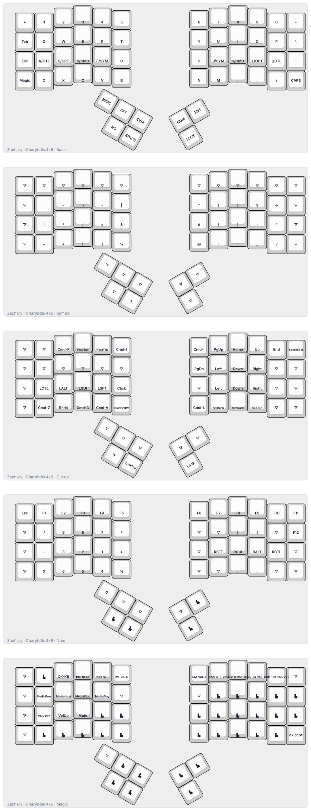

# Charybdis QMK keymap

This workspace contains the BastardKB QMK source checkout on the `bkb-master`
branch and a Charybdis 4x6 keymap adapted from the existing Voyager layout.
The `getreuer/qmk-modules` repository is pinned as a submodule so the
Voyager-style word and line selection keycodes remain available.

The current target is the modern Splinky/Splinktegrated RP2040 controller:

```sh
cd qmk
qmk config user.qmk_home="$(pwd)"
qmk compile -c -kb bastardkb/charybdis/4x6 -km zachary
```

The compiled firmware is a `.uf2` file. QMK can wait for the bootloader and
flash interactively:

```sh
qmk flash -c -kb bastardkb/charybdis/4x6 -km zachary
```

For the manual method, disconnect both halves and the interconnect cable. Plug
in only one half, double-press its reset button, and copy the generated `.uf2`
file to the RP2040 mass-storage drive. Eject it, disconnect that half, and
repeat the process for the other half. Reconnect the two halves only after both
have been flashed.

The keymap source is:

```text
keyboards/bastardkb/charybdis/4x6/keymaps/zachary/
```

## Layout diagram



Regenerate it with:

```sh
python3 scripts/draw_keymap.py
```

The source supports the 4x6 Charybdis. For the Nano or Mini, use the matching
`bastardkb/charybdis/3x5` or `bastardkb/charybdis/3x6` target and adapt the
layout before flashing.

Reference: <https://docs.bastardkb.com/fw/compile-firmware.html>
